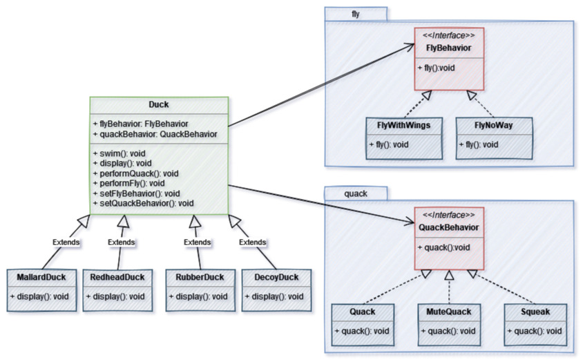

# Strategy

## Use case - SimUDuck

SimUDuc, a duck-pond simulation game, shows a large variety of duck species swimming, flying and making quaking sounds. 

The flying and quaking behaviors can be shared between many ducks, which reinforces the need for reusability between classes, but some special ducks need special behaviors (`Rubber` ducks squeak instead of quaking. `Decoy` ducks do not even squeak, and neither can fly). You could fix this with inheritance and overwriting in the specific classes, but there's a more maintanable, more reusable approach. 

With `Strategy Design Pattern` we can create families of algorithms (behaviors) which are interchangeable between them. This allows each duck to be assigned the behavior they need without the tight coupling of inheritance. Creating new behaviors also becomes trivial, since you only need to create a new class implementing the neccessary behavior interface (`FlyBehavior` or `QuackBehavior`). 

As an added benefit, these algorithms can also be assigned on runtime, allowing ducks to change how they fly or quack without even needing to change code. 

## UML Diagram

